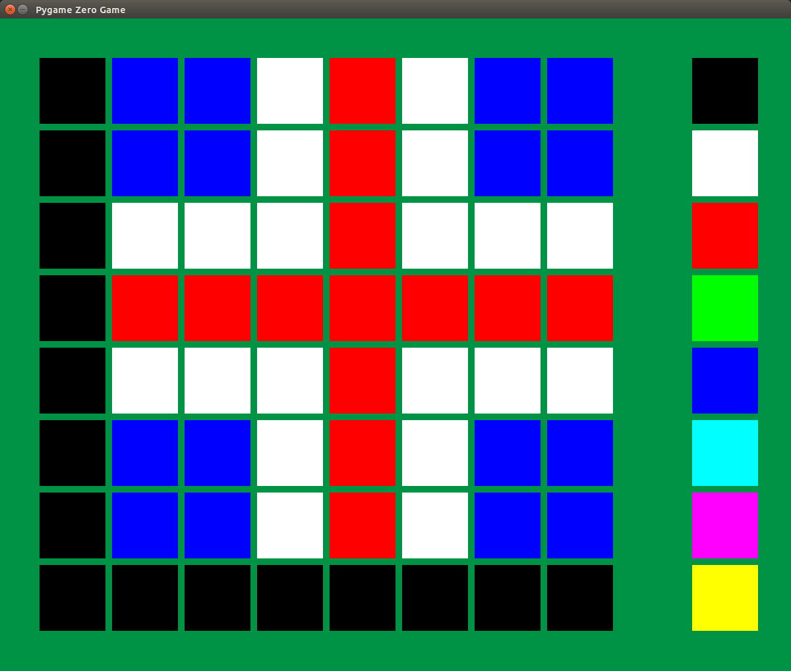

# pgz-sense-hat

PyGame Zero app for drawing patterns on the Sense HAT



## Requirements

### Hardware

- [Sense HAT](https://www.raspberrypi.org/products/sense-hat/)

### Software

- [Sense HAT](http://pythonhosted.org/sense-hat/)
- [PyGame Zero](http://pygame-zero.readthedocs.org/)

## Run

Download this repo, extract the contents, enter the directory and run the app:

```bash
wget https://github.com/bennuttall/pgz-sense-hat/archive/master.tar.gz
tar xzf master.tar.gz
cd pgz-sense-hat-master/app
pgzrun app.py
```

## Inspiration

Based on a [similar app](https://github.com/topshed/RPi_8x8GridDraw/blob/master/8x8grid-sense.py) by [Richard Hayler](https://github.com/topshed)
